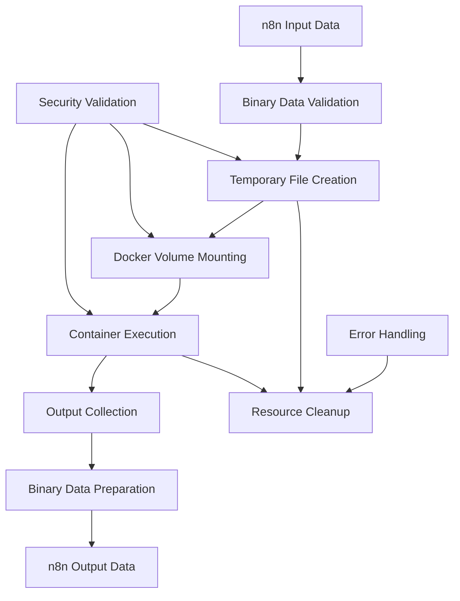

# Binary Data Handling Best Practices for n8n Docker Container Nodes

## Executive Summary

This comprehensive guide covers best practices for handling binary data in n8n nodes that interact with Docker containers. It provides concrete patterns, security considerations, and implementation examples for efficiently passing binary files into containers and exporting processed files as binary data that other n8n nodes can consume.

## Table of Contents

1. [Understanding n8n Binary Data Architecture](#understanding-n8n-binary-data-architecture)
2. [Docker Container Integration Patterns](#docker-container-integration-patterns)
3. [Input: Binary Files to Docker Containers](#input-binary-files-to-docker-containers)
4. [Output: Binary Files from Docker Containers](#output-binary-files-from-docker-containers)
5. [Security Considerations](#security-considerations)
6. [Performance Optimization](#performance-optimization)
7. [Error Handling and Resilience](#error-handling-and-resilience)
8. [Complete Implementation Example](#complete-implementation-example)
9. [Testing Strategies](#testing-strategies)
10. [Best Practices Checklist](#best-practices-checklist)

---

## Understanding n8n Binary Data Architecture

### Core Binary Data Interface

n8n uses a structured binary data format defined by the `IBinaryData` interface:

```typescript
interface IBinaryData {
    data: string;              // Base64-encoded binary data (in-memory) or storage identifier
    mimeType: string;          // MIME type (e.g., 'image/png', 'application/pdf')
    fileType?: BinaryFileType;  // File type categorization
    fileName?: string;         // Original file name
    directory?: string;        // File directory path
    fileExtension?: string;    // File extension
    fileSize?: string;         // File size (TODO: should be number)
    id?: string;              // Storage identifier for external storage modes
}
```

### Binary Data Storage Modes

n8n supports multiple storage backends for binary data:

- **`default`**: In-memory storage (base64 encoded) - suitable for small files
- **`filesystem-v2`**: Local filesystem storage - for larger files
- **`s3`**: Amazon S3 storage (Enterprise) - for distributed deployments

### Key Helper Functions

The most important binary data helper functions for Docker nodes:

```typescript
// Input validation and retrieval
this.helpers.assertBinaryData(itemIndex, binaryPropertyName);
this.helpers.getBinaryDataBuffer(itemIndex, binaryPropertyName);
this.helpers.getBinaryStream(binaryDataId, chunkSize);

// Output preparation
this.helpers.prepareBinaryData(bufferOrStream, fileName, mimeType);
this.helpers.setBinaryDataBuffer(binaryData, bufferOrStream, workflowId, executionId);

// Utilities
this.helpers.binaryToBuffer(stream);
this.helpers.binaryToString(buffer, encoding);
this.helpers.isFilePathBlocked(filePath);
```

---

## Docker Container Integration Patterns

### Architecture Overview

For Docker container nodes handling binary data, the recommended architecture follows this pattern:



### Key Design Principles

1. **Abstract Storage Complexity**: Nodes should work transparently with both in-memory and external storage
2. **Security-First**: Validate all file paths and container operations
3. **Memory Efficiency**: Use streams for large files, temporary files for container operations
4. **Graceful Degradation**: Provide meaningful error handling and cleanup
5. **Resource Management**: Proper cleanup of temporary files and containers

---

## Input: Binary Files to Docker Containers

### Pattern 1: Single Binary File Input

```typescript
// Node properties for binary input
const inputProperties: INodeProperties[] = [
    {
        displayName: 'Input Binary Field',
        name: 'binaryPropertyName',
        type: 'string',
        default: 'data',
        required: true,
        description: 'Name of the binary field containing the file to process in the container',
    },
    {
        displayName: 'Container Input Path',
        name: 'containerInputPath',
        type: 'string',
        default: '/input',
        required: true,
        description: 'Path where the input file will be mounted inside the container',
    }
];

// Execution pattern
async execute(this: IExecuteFunctions): Promise<INodeExecutionData[][]> {
    const items = this.getInputData();
    const returnData: INodeExecutionData[] = [];

    for (let itemIndex = 0; itemIndex < items.length; itemIndex++) {
        // Get binary data with validation
        const binaryPropertyName = this.getNodeParameter('binaryPropertyName', itemIndex) as string;
        const binaryData = this.helpers.assertBinaryData(itemIndex, binaryPropertyName);

        // Get buffer (handles both in-memory and external storage)
        const buffer = await this.helpers.getBinaryDataBuffer(itemIndex, binaryPropertyName);

        // Create temporary file for Docker
        const tempDir = await fs.mkdtemp(path.join(os.tmpdir(), 'n8n-docker-'));
        const inputFileName = binaryData.fileName || 'input.bin';
        const tempInputPath = path.join(tempDir, inputFileName);

        // Security check
        const isPathBlocked = await this.helpers.isFilePathBlocked(tempInputPath);
        if (isPathBlocked) {
            await fs.rm(tempDir, { recursive: true });
            throw new NodeOperationError(
                this.getNode(),
                'Access to temporary directory is not allowed'
            );
        }

        // Write binary data to temporary file
        await fs.writeFile(tempInputPath, buffer);

        try {
            // Execute container with mounted input
            const containerConfig = this.buildContainerConfig(tempInputPath, itemIndex);
            const result = await this.executeContainerWithInput(containerConfig);

            // Process results (see Output section)
            const outputBinary = await this.processContainerOutput(result, tempDir);

            returnData.push({
                json: {
                    ...items[itemIndex].json,
                    container: {
                        exitCode: result.exitCode,
                        stdout: result.stdout,
                        stderr: result.stderr
                    }
                },
                binary: outputBinary,
                pairedItem: { item: itemIndex }
            });

        } finally {
            // Always cleanup temporary files
            await this.cleanupTempFiles(tempDir);
        }
    }

    return [returnData];
}
```

### Pattern 2: Multiple Binary Files Input

```typescript
// Enhanced properties for multiple files
const multiInputProperties: INodeProperties[] = [
    {
        displayName: 'Binary File Mapping',
        name: 'binaryFileMapping',
        type: 'fixedCollection',
        typeOptions: {
            multipleValues: true,
        },
        default: {
            values: [
                {
                    fieldName: 'input',
                    binaryPropertyName: 'data',
                    containerPath: '/input'
                }
            ]
        },
        options: [
            {
                name: 'values',
                displayName: 'File Mappings',
                values: [
                    {
                        displayName: 'Field Name',
                        name: 'fieldName',
                        type: 'string',
                        default: 'input',
                        description: 'Identifier for this file in the container',
                        required: true
                    },
                    {
                        displayName: 'Binary Property',
                        name: 'binaryPropertyName',
                        type: 'string',
                        default: 'data',
                        description: 'Name of the binary property containing the file',
                        required: true
                    },
                    {
                        displayName: 'Container Path',
                        name: 'containerPath',
                        type: 'string',
                        default: '/input',
                        description: 'Mount path inside the container',
                        required: true
                    }
                ]
            }
        ]
    }
];

// Processing multiple files
private async prepareMultipleBinaryFiles(
    itemIndex: number,
    fileMappings: any[]
): Promise<{ tempDir: string; mountPoints: Array<{hostPath: string, containerPath: string}> }> {
    const tempDir = await fs.mkdtemp(path.join(os.tmpdir(), 'n8n-docker-'));
    const mountPoints: Array<{hostPath: string, containerPath: string}> = [];

    try {
        for (const mapping of fileMappings) {
            // Validate and get binary data
            const binaryData = this.helpers.assertBinaryData(itemIndex, mapping.binaryPropertyName);
            const buffer = await this.helpers.getBinaryDataBuffer(itemIndex, mapping.binaryPropertyName);

            // Create temporary file
            const fileName = binaryData.fileName || `${mapping.fieldName}.bin`;
            const hostPath = path.join(tempDir, fileName);

            await fs.writeFile(hostPath, buffer);
            mountPoints.push({
                hostPath,
                containerPath: mapping.containerPath
            });
        }

        return { tempDir, mountPoints };
    } catch (error) {
        // Cleanup on failure
        await fs.rm(tempDir, { recursive: true });
        throw error;
    }
}
```

### Pattern 3: Stream-Based Large File Handling

For large files that shouldn't be loaded entirely into memory:

```typescript
private async prepareStreamedInput(
    binaryData: IBinaryData,
    tempDir: string
): Promise<string> {
    const fileName = binaryData.fileName || 'input.bin';
    const tempPath = path.join(tempDir, fileName);

    // Create write stream
    const writeStream = fs.createWriteStream(tempPath);

    try {
        if (binaryData.id) {
            // External storage - use stream directly
            const readStream = await this.helpers.getBinaryStream(binaryData.id);
            await this.pipeStream(readStream, writeStream);
        } else {
            // In-memory storage - convert from base64
            const buffer = Buffer.from(binaryData.data, 'base64');
            await fs.writeFile(tempPath, buffer);
        }

        return tempPath;
    } catch (error) {
        writeStream.destroy();
        throw error;
    }
}

private async pipeStream(readable: NodeJS.ReadableStream, writable: NodeJS.WritableStream): Promise<void> {
    return new Promise((resolve, reject) => {
        readable.pipe(writable)
            .on('finish', resolve)
            .on('error', reject);
    });
}
```

---

## Output: Binary Files from Docker Containers

### Pattern 1: Known Output Files

```typescript
private async processContainerOutput(
    containerResult: any,
    tempDir: string,
    outputFileName?: string
): Promise<{ [key: string]: IBinaryData }> {
    const outputBinary: { [key: string]: IBinaryData } = {};

    // Check for expected output files
    const expectedFiles = [
        'output.bin',
        'result.pdf',
        'processed.png',
        outputFileName
    ].filter(Boolean);

    for (const fileName of expectedFiles) {
        const filePath = path.join(tempDir, fileName);

        try {
            const stats = await fs.stat(filePath);
            if (stats.isFile()) {
                const buffer = await fs.readFile(filePath);
                outputBinary['output'] = await this.helpers.prepareBinaryData(
                    buffer,
                    fileName,
                    this.getMimeTypeFromFile(fileName)
                );
                break; // Found output file
            }
        } catch (error) {
            // File doesn't exist, continue checking
        }
    }

    return outputBinary;
}
```

### Pattern 2: Dynamic Output Discovery

```typescript
private async discoverOutputFiles(tempDir: string): Promise<{ [key: string]: IBinaryData }> {
    const outputBinary: { [key: string]: IBinaryData } = {};

    try {
        const files = await fs.readdir(tempDir);

        for (const file of files) {
            const filePath = path.join(tempDir, file);
            const stats = await fs.stat(filePath);

            if (stats.isFile() && !file.startsWith('input_')) {
                // Skip input files, process only outputs
                const buffer = await fs.readFile(filePath);
                const fileKey = this.sanitizeFileName(file);

                outputBinary[fileKey] = await this.helpers.prepareBinaryData(
                    buffer,
                    file,
                    this.getMimeTypeFromFile(file)
                );
            }
        }
    } catch (error) {
        // Directory doesn't exist or can't be read
    }

    return outputBinary;
}

private sanitizeFileName(fileName: string): string {
    // Replace invalid characters for binary data keys
    return fileName.replace(/[^a-zA-Z0-9._-]/g, '_');
}

private getMimeTypeFromFile(fileName: string): string {
    const ext = path.extname(fileName).toLowerCase();
    const mimeTypes: { [key: string]: string } = {
        '.pdf': 'application/pdf',
        '.png': 'image/png',
        '.jpg': 'image/jpeg',
        '.jpeg': 'image/jpeg',
        '.gif': 'image/gif',
        '.txt': 'text/plain',
        '.json': 'application/json',
        '.csv': 'text/csv',
        '.zip': 'application/zip'
    };

    return mimeTypes[ext] || 'application/octet-stream';
}
```

### Pattern 3: Container Output Directory Mounting

```typescript
// Enhanced container configuration with output directory
private buildContainerConfig(tempDir: string, itemIndex: number): ContainerExecutionConfig {
    const baseConfig = this.getBaseContainerConfig(itemIndex);

    // Add volume mounts for both input and output
    const volumeMounts = [
        `${tempDir}/input:/input:ro`,     // Read-only input
        `${tempDir}/output:/output:rw`    // Read-write output
    ];

    // Modify container options to include volume mounts
    const containerOptions = {
        ...baseConfig,
        volumes: volumeMounts,
        workingDir: '/workspace',  // Container working directory
        environmentVariables: [
            ...(baseConfig.environmentVariables || []),
            `INPUT_DIR=/input`,
            `OUTPUT_DIR=/output`
        ]
    };

    return containerOptions;
}

// Container execution with output collection
private async executeContainerWithOutput(
    config: ContainerExecutionConfig,
    tempDir: string
): Promise<any> {
    // Ensure output directory exists
    const outputDir = path.join(tempDir, 'output');
    await fs.mkdir(outputDir, { recursive: true });

    // Execute container
    const result = await executeContainer(config);

    // Collect output files
    const outputFiles = await this.discoverOutputFiles(outputDir);

    return {
        ...result,
        outputFiles,
        outputDir
    };
}
```

---

## Security Considerations

### File Path Validation

```typescript
private async validateFilePaths(tempDir: string, inputFiles: string[]): Promise<void> {
    // Check temporary directory access
    const isTempDirBlocked = await this.helpers.isFilePathBlocked(tempDir);
    if (isTempDirBlocked) {
        throw new NodeOperationError(
            this.getNode(),
            'Access to temporary directory is not allowed'
        );
    }

    // Validate individual files don't escape temp directory
    for (const filePath of inputFiles) {
        const resolvedPath = path.resolve(filePath);
        const resolvedTempDir = path.resolve(tempDir);

        if (!resolvedPath.startsWith(resolvedTempDir)) {
            throw new NodeOperationError(
                this.getNode(),
                'File path escapes allowed directory'
            );
        }
    }
}
```

### Container Security Configuration

```typescript
private buildSecureContainerConfig(baseConfig: ContainerExecutionConfig): ContainerExecutionConfig {
    return {
        ...baseConfig,
        // Security constraints
        readOnlyRootfs: true,        // Read-only root filesystem
        noNewPrivileges: true,       // Prevent privilege escalation
        dropCapabilities: [
            'ALL'                    // Drop all Linux capabilities
        ],
        addCapabilities: [],         // Add only necessary capabilities
        // Resource limits
        memory: 512 * 1024 * 1024,   // 512MB memory limit
        cpuQuota: 50000,             // 50% CPU limit
        // Network isolation
        networkMode: 'none',         // No network access for processing containers
        // User isolation
        user: 'nobody'               // Run as non-root user
    };
}
```

### Input Sanitization

```typescript
private sanitizeContainerImage(imageName: string): string {
    // Validate and sanitize Docker image name
    const imageRegex = /^[a-z0-9]+(?:[._-][a-z0-9]+)*(?:\/[a-z0-9]+(?:[._-][a-z0-9]+)*)*(?::[a-zA-Z0-9][a-zA-Z0-9._-]*)?$/;

    if (!imageRegex.test(imageName)) {
        throw new NodeOperationError(
            this.getNode(),
            `Invalid Docker image name: ${imageName}`
        );
    }

    return imageName.toLowerCase();
}

private sanitizeContainerCommand(command: string): string[] {
    // Parse and sanitize command arguments
    const args = command.split(/\s+/).filter(arg => arg.length > 0);

    // Prevent command injection
    const dangerousPatterns = [
        /&&/, /\|\|/, /;/, /`/, /\$\(/, />\s*/, /<\s*/
    ];

    for (const arg of args) {
        for (const pattern of dangerousPatterns) {
            if (pattern.test(arg)) {
                throw new NodeOperationError(
                    this.getNode(),
                    `Potentially dangerous command argument: ${arg}`
                );
            }
        }
    }

    return args;
}
```

---

## Performance Optimization

### Memory-Efficient Processing

```typescript
// Chunked processing for large files
private async processLargeFileInChunks(
    binaryData: IBinaryData,
    chunkSize: number = 1024 * 1024 // 1MB chunks
): Promise<void> {
    if (binaryData.id) {
        // External storage - use chunked streaming
        const stream = await this.helpers.getBinaryStream(binaryData.id, chunkSize);

        for await (const chunk of stream) {
            // Process chunk without loading entire file into memory
            await this.processChunk(chunk);
        }
    } else {
        // In-memory storage - process in chunks
        const buffer = Buffer.from(binaryData.data, 'base64');

        for (let offset = 0; offset < buffer.length; offset += chunkSize) {
            const chunk = buffer.subarray(offset, offset + chunkSize);
            await this.processChunk(chunk);
        }
    }
}
```

### Parallel Processing

```typescript
// Process multiple files in parallel
private async processMultipleFilesInParallel(
    fileMappings: any[],
    itemIndex: number
): Promise<{ [key: string]: IBinaryData }> {
    const processingPromises = fileMappings.map(async (mapping, index) => {
        try {
            const binaryData = this.helpers.assertBinaryData(itemIndex, mapping.binaryPropertyName);
            const buffer = await this.helpers.getBinaryDataBuffer(itemIndex, mapping.binaryPropertyName);

            // Process file
            const processedBuffer = await this.processFile(buffer, mapping.options);

            return {
                key: mapping.fieldName,
                binary: await this.helpers.prepareBinaryData(
                    processedBuffer,
                    binaryData.fileName,
                    binaryData.mimeType
                )
            };
        } catch (error) {
            return {
                key: mapping.fieldName,
                error: error.message
            };
        }
    });

    const results = await Promise.allSettled(processingPromises);
    const outputBinary: { [key: string]: IBinaryData } = {};

    results.forEach((result, index) => {
        if (result.status === 'fulfilled') {
            const { key, binary, error } = result.value;
            if (binary) {
                outputBinary[key] = binary;
            } else if (error) {
                console.error(`Error processing ${key}: ${error}`);
            }
        } else {
            console.error(`Failed to process file ${index}: ${result.reason}`);
        }
    });

    return outputBinary;
}
```

### Container Resource Management

```typescript
// Smart resource allocation based on file size
private calculateContainerResources(fileSizes: number[]): {
    memory: number;
    cpuQuota: number;
    timeout: number;
} {
    const totalSize = fileSizes.reduce((sum, size) => sum + size, 0);
    const maxSize = Math.max(...fileSizes);

    // Base memory + 10x file size for processing
    const baseMemory = 256 * 1024 * 1024; // 256MB
    const processingMemory = totalSize * 10;
    const memory = Math.min(
        Math.max(baseMemory + processingMemory, 512 * 1024 * 1024),
        2 * 1024 * 1024 * 1024 // Max 2GB
    );

    // CPU allocation based on workload
    const cpuQuota = totalSize > 100 * 1024 * 1024 ? 100000 : 50000; // 100% vs 50%

    // Timeout based on file size (1 minute per 10MB, max 30 minutes)
    const timeout = Math.min(
        Math.max(60000, Math.ceil(totalSize / (10 * 1024 * 1024)) * 60000),
        30 * 60 * 1000
    );

    return { memory, cpuQuota, timeout };
}
```

---

## Error Handling and Resilience

### Comprehensive Error Handling

```typescript
async execute(this: IExecuteFunctions): Promise<INodeExecutionData[][]> {
    const items = this.getInputData();
    const returnData: INodeExecutionData[] = [];
    const tempDirectories: string[] = []; // Track for cleanup

    try {
        for (let itemIndex = 0; itemIndex < items.length; itemIndex++) {
            const tempDir = await fs.mkdtemp(path.join(os.tmpdir(), 'n8n-docker-'));
            tempDirectories.push(tempDir);

            try {
                const result = await this.processItem(itemIndex, tempDir);
                returnData.push(result);
            } catch (error) {
                const processedError = this.handleError(error, itemIndex);

                if (this.continueOnFail()) {
                    returnData.push(processedError);
                } else {
                    throw processedError.json.error;
                }
            }
        }

        return [returnData];

    } finally {
        // Always cleanup temporary directories
        await Promise.all(
            tempDirectories.map(dir => this.cleanupTempFiles(dir).catch(console.error))
        );
    }
}

private handleError(error: any, itemIndex: number): INodeExecutionData {
    const errorMessage = error.message || 'Unknown error occurred';
    const errorType = this.categorizeError(error);

    return {
        json: {
            error: {
                message: errorMessage,
                type: errorType,
                timestamp: new Date().toISOString(),
                itemIndex
            },
            success: false
        },
        pairedItem: { item: itemIndex }
    };
}

private categorizeError(error: any): string {
    if (error.message.includes('ENOENT')) return 'FileNotFound';
    if (error.message.includes('EACCES')) return 'PermissionDenied';
    if (error.message.includes('Docker')) return 'ContainerError';
    if (error.message.includes('timeout')) return 'TimeoutError';
    if (error.message.includes('memory')) return 'MemoryError';

    return 'UnknownError';
}
```

### Resource Cleanup

```typescript
private async cleanupTempFiles(tempDir: string): Promise<void> {
    try {
        // Check if directory exists
        await fs.access(tempDir);

        // Remove directory recursively
        await fs.rm(tempDir, {
            recursive: true,
            force: true,
            maxRetries: 3,
            retryDelay: 1000
        });
    } catch (error) {
        // Log cleanup error but don't throw
        console.error(`Failed to cleanup temporary directory ${tempDir}:`, error);
    }
}

// Cleanup orphaned containers on startup
private async cleanupOrphanedContainers(): Promise<void> {
    try {
        const docker = initializeDockerClient();
        const containers = await docker.listContainers({ all: true });

        const n8nContainers = containers.filter(container =>
            container.Labels &&
            container.Labels['n8n-node'] === 'runContainer' &&
            container.Labels['status'] === 'running'
        );

        // Stop and remove orphaned containers older than 1 hour
        const oneHourAgo = Date.now() - (60 * 60 * 1000);

        for (const container of n8nContainers) {
            const created = new Date(container.Created).getTime();
            if (created < oneHourAgo) {
                try {
                    const containerInstance = docker.getContainer(container.Id);
                    await containerInstance.remove({ force: true });
                } catch (error) {
                    console.error(`Failed to cleanup container ${container.Id}:`, error);
                }
            }
        }
    } catch (error) {
        console.error('Failed to cleanup orphaned containers:', error);
    }
}
```

---

## Complete Implementation Example

### Enhanced Docker Container Node

```typescript
import {
    IExecuteFunctions,
    INodeExecutionData,
    INodeType,
    INodeTypeDescription,
    NodeOperationError,
} from 'n8n-workflow';
import * as fs from 'fs/promises';
import * as path from 'path';
import * as os from 'os';
import Docker from 'dockerode';

import { mainProperties } from './Description';
import {
    executeContainer,
    ContainerExecutionConfig
} from './ContainerHelpers';
import {
    processEnvironmentVariables,
    validateDockerImageName,
    formatDockerError
} from './GenericFunctions';

export class RunContainerWithBinary implements INodeType {
    description: INodeTypeDescription = {
        displayName: 'Run Container with Binary',
        name: 'runContainerWithBinary',
        icon: { light: 'file:img/runContainer.svg', dark: 'file:img/runContainer.dark.svg' },
        group: ['transform'],
        version: 1,
        description: 'Runs a Docker container with binary file input/output support',
        defaults: {
            name: 'Run Container with Binary',
        },
        inputs: ['main'],
        outputs: ['main'],
        properties: [
            ...mainProperties,
            // Binary input properties
            {
                displayName: 'Binary File Mapping',
                name: 'binaryFileMapping',
                type: 'fixedCollection',
                typeOptions: {
                    multipleValues: true,
                },
                default: {
                    values: [
                        {
                            fieldName: 'input',
                            binaryPropertyName: 'data',
                            containerPath: '/input'
                        }
                    ]
                },
                options: [
                    {
                        name: 'values',
                        displayName: 'File Mappings',
                        values: [
                            {
                                displayName: 'Field Name',
                                name: 'fieldName',
                                type: 'string',
                                default: 'input',
                                required: true,
                                description: 'Identifier for this file in the container'
                            },
                            {
                                displayName: 'Binary Property',
                                name: 'binaryPropertyName',
                                type: 'string',
                                default: 'data',
                                required: true,
                                description: 'Name of the binary property containing the file'
                            },
                            {
                                displayName: 'Container Path',
                                name: 'containerPath',
                                type: 'string',
                                default: '/input',
                                required: true,
                                description: 'Mount path inside the container'
                            }
                        ]
                    }
                ]
            },
            {
                displayName: 'Output Files',
                name: 'outputFiles',
                type: 'string',
                default: '',
                description: 'Comma-separated list of expected output files (wildcards supported: output_*.png)',
                placeholder: 'output.pdf, result.png, processed_*.txt'
            },
            {
                displayName: 'Container Working Directory',
                name: 'workingDirectory',
                type: 'string',
                default: '/workspace',
                description: 'Working directory inside the container'
            }
        ],
        usableAsTool: true,
    };

    async execute(this: IExecuteFunctions): Promise<INodeExecutionData[][]> {
        const items = this.getInputData();
        const returnData: INodeExecutionData[] = [];
        const tempDirectories: string[] = [];

        try {
            for (let itemIndex = 0; itemIndex < items.length; itemIndex++) {
                const tempDir = await fs.mkdtemp(path.join(os.tmpdir(), 'n8n-docker-binary-'));
                tempDirectories.push(tempDir);

                try {
                    const result = await this.processItemWithBinary(itemIndex, tempDir);
                    returnData.push(result);
                } catch (error) {
                    const processedError = this.handleError(error, itemIndex);

                    if (this.continueOnFail()) {
                        returnData.push(processedError);
                    } else {
                        throw new NodeOperationError(this.getNode(), processedError.json.error.message);
                    }
                }
            }

            return [returnData];

        } finally {
            // Always cleanup temporary directories
            await Promise.allSettled(
                tempDirectories.map(dir => this.cleanupTempFiles(dir))
            );
        }
    }

    private async processItemWithBinary(
        itemIndex: number,
        tempDir: string
    ): Promise<INodeExecutionData> {
        // Prepare input files
        const fileMappings = this.getNodeParameter('binaryFileMapping', itemIndex, {
            values: []
        }).values || [];

        const { mountPoints, fileSizes } = await this.prepareBinaryFiles(
            itemIndex,
            fileMappings,
            tempDir
        );

        // Build container configuration
        const containerConfig = await this.buildBinaryContainerConfig(
            itemIndex,
            tempDir,
            mountPoints,
            fileSizes
        );

        // Execute container
        const containerResult = await this.executeContainerWithBinary(
            containerConfig,
            tempDir
        );

        // Collect output files
        const outputBinary = await this.collectOutputFiles(
            tempDir,
            itemIndex
        );

        return {
            json: {
                ...this.getInputData()[itemIndex].json,
                container: {
                    exitCode: containerResult.exitCode,
                    stdout: containerResult.stdout,
                    stderr: containerResult.stderr,
                    success: containerResult.success,
                    inputFiles: fileMappings.length,
                    outputFiles: Object.keys(outputBinary).length
                }
            },
            binary: outputBinary,
            pairedItem: { item: itemIndex }
        };
    }

    private async prepareBinaryFiles(
        itemIndex: number,
        fileMappings: any[],
        tempDir: string
    ): Promise<{ mountPoints: Array<{hostPath: string, containerPath: string}>, fileSizes: number[] }> {
        const mountPoints: Array<{hostPath: string, containerPath: string}> = [];
        const fileSizes: number[] = [];

        for (const mapping of fileMappings) {
            // Validate and get binary data
            const binaryData = this.helpers.assertBinaryData(itemIndex, mapping.binaryPropertyName);
            const buffer = await this.helpers.getBinaryDataBuffer(itemIndex, mapping.binaryPropertyName);

            // Create input directory
            const inputDir = path.join(tempDir, 'input');
            await fs.mkdir(inputDir, { recursive: true });

            // Create temporary file
            const fileName = binaryData.fileName || `${mapping.fieldName}.bin`;
            const hostPath = path.join(inputDir, fileName);

            // Security check
            const isPathBlocked = await this.helpers.isFilePathBlocked(hostPath);
            if (isPathBlocked) {
                throw new NodeOperationError(
                    this.getNode(),
                    `Access to file path ${hostPath} is not allowed`
                );
            }

            await fs.writeFile(hostPath, buffer);
            mountPoints.push({
                hostPath,
                containerPath: mapping.containerPath
            });

            fileSizes.push(buffer.length);
        }

        return { mountPoints, fileSizes };
    }

    private async buildBinaryContainerConfig(
        itemIndex: number,
        tempDir: string,
        mountPoints: Array<{hostPath: string, containerPath: string}>,
        fileSizes: number[]
    ): Promise<ContainerExecutionConfig> {
        const image = this.getNodeParameter('image', itemIndex) as string;
        const entrypoint = this.getNodeParameter('entrypoint', itemIndex, '') as string;
        const command = this.getNodeParameter('command', itemIndex, '') as string;
        const workingDirectory = this.getNodeParameter('workingDirectory', itemIndex, '/workspace') as string;

        // Validate image name
        const imageValidation = validateDockerImageName(image);
        if (!imageValidation.valid) {
            throw new NodeOperationError(
                this.getNode(),
                `Invalid Docker image: ${imageValidation.errors.join(', ')}`,
                { itemIndex }
            );
        }

        // Process environment variables
        const envResult = await processEnvironmentVariables.call(this, itemIndex);

        // Calculate resources based on file sizes
        const resources = this.calculateContainerResources(fileSizes);

        // Build Docker volume mounts
        const volumeMounts = [
            ...mountPoints.map(mp => `${mp.hostPath}:${mp.containerPath}:ro`), // Read-only input
            `${path.join(tempDir, 'output')}:/output:rw` // Read-write output
        ];

        return {
            image,
            entrypoint: entrypoint || undefined,
            command: command || undefined,
            environmentVariables: [
                ...(envResult.variables || []),
                'INPUT_DIR=/input',
                'OUTPUT_DIR=/output',
                `WORKING_DIR=${workingDirectory}`
            ],
            workingDir: workingDirectory,
            volumes: volumeMounts,
            autoRemove: true,
            pullPolicy: 'missing',
            memory: resources.memory,
            cpuQuota: resources.cpuQuota,
            timeout: resources.timeout,
            readOnlyRootfs: true,
            noNewPrivileges: true
        };
    }

    private async executeContainerWithBinary(
        config: ContainerExecutionConfig,
        tempDir: string
    ): Promise<any> {
        // Ensure output directory exists
        const outputDir = path.join(tempDir, 'output');
        await fs.mkdir(outputDir, { recursive: true });

        // Execute container with timeout
        return await executeContainer(
            config,
            (progress) => {
                // Optional: Log progress for debugging
                if (progress.status && progress.status !== 'Downloading') {
                    console.log(`Docker operation: ${progress.status}`);
                }
            }
        );
    }

    private async collectOutputFiles(
        tempDir: string,
        itemIndex: number
    ): Promise<{ [key: string]: IBinaryData }> {
        const outputBinary: { [key: string]: IBinaryData } = {};
        const outputDir = path.join(tempDir, 'output');
        const outputFilesSpec = this.getNodeParameter('outputFiles', itemIndex, '') as string;

        try {
            const files = await fs.readdir(outputDir);

            // Filter files based on specification
            const outputPatterns = outputFilesSpec
                ? outputFilesSpec.split(',').map(p => p.trim())
                : ['*']; // All files if not specified

            for (const pattern of outputPatterns) {
                const regex = new RegExp(pattern.replace(/\*/g, '.*'));

                for (const file of files) {
                    if (regex.test(file)) {
                        const filePath = path.join(outputDir, file);
                        const stats = await fs.stat(filePath);

                        if (stats.isFile()) {
                            const buffer = await fs.readFile(filePath);
                            const fileKey = this.sanitizeFileName(file);

                            outputBinary[fileKey] = await this.helpers.prepareBinaryData(
                                buffer,
                                file,
                                this.getMimeTypeFromFile(file)
                            );
                        }
                    }
                }
            }
        } catch (error) {
            // No output files or can't read output directory
            console.warn('No output files found or cannot read output directory:', error.message);
        }

        return outputBinary;
    }

    private calculateContainerResources(fileSizes: number[]): {
        memory: number;
        cpuQuota: number;
        timeout: number;
    } {
        const totalSize = fileSizes.reduce((sum, size) => sum + size, 0);
        const maxSize = Math.max(...fileSizes, 0);

        // Base memory + file size requirements
        const baseMemory = 256 * 1024 * 1024; // 256MB
        const processingMemory = Math.max(totalSize * 2, maxSize * 4); // Processing overhead
        const memory = Math.min(
            Math.max(baseMemory + processingMemory, 512 * 1024 * 1024),
            4 * 1024 * 1024 * 1024 // Max 4GB
        );

        // CPU allocation
        const cpuQuota = totalSize > 50 * 1024 * 1024 ? 150000 : 75000; // 150% vs 75%

        // Timeout based on file size
        const baseTimeout = 60000; // 1 minute
        const processingTimeout = Math.ceil(totalSize / (10 * 1024 * 1024)) * 30000; // 30s per 10MB
        const timeout = Math.min(
            Math.max(baseTimeout + processingTimeout, 120000),
            10 * 60 * 1000 // Max 10 minutes
        );

        return { memory, cpuQuota, timeout };
    }

    private sanitizeFileName(fileName: string): string {
        return fileName.replace(/[^a-zA-Z0-9._-]/g, '_');
    }

    private getMimeTypeFromFile(fileName: string): string {
        const ext = path.extname(fileName).toLowerCase();
        const mimeTypes: { [key: string]: string } = {
            '.pdf': 'application/pdf',
            '.png': 'image/png',
            '.jpg': 'image/jpeg',
            '.jpeg': 'image/jpeg',
            '.gif': 'image/gif',
            '.txt': 'text/plain',
            '.json': 'application/json',
            '.csv': 'text/csv',
            '.zip': 'application/zip',
            '.tar': 'application/x-tar',
            '.gz': 'application/gzip'
        };

        return mimeTypes[ext] || 'application/octet-stream';
    }

    private handleError(error: any, itemIndex: number): INodeExecutionData {
        const errorMessage = error.message || 'Unknown error occurred';
        const errorType = this.categorizeError(error);

        return {
            json: {
                error: {
                    message: errorMessage,
                    type: errorType,
                    timestamp: new Date().toISOString(),
                    itemIndex
                },
                success: false,
                exitCode: -1
            },
            pairedItem: { item: itemIndex }
        };
    }

    private categorizeError(error: any): string {
        if (error.message.includes('ENOENT')) return 'FileNotFound';
        if (error.message.includes('EACCES')) return 'PermissionDenied';
        if (error.message.includes('Docker')) return 'ContainerError';
        if (error.message.includes('timeout')) return 'TimeoutError';
        if (error.message.includes('memory')) return 'MemoryError';

        return 'UnknownError';
    }

    private async cleanupTempFiles(tempDir: string): Promise<void> {
        try {
            await fs.access(tempDir);
            await fs.rm(tempDir, {
                recursive: true,
                force: true,
                maxRetries: 3,
                retryDelay: 1000
            });
        } catch (error) {
            console.error(`Failed to cleanup temporary directory ${tempDir}:`, error);
        }
    }
}
```

---

## Testing Strategies

### Unit Testing Binary Processing

```typescript
import { BinaryData } from 'n8n-workflow';

describe('Binary Container Node', () => {
    let node: RunContainerWithBinary;
    let mockHelpers: any;

    beforeEach(() => {
        // Setup mocks
        mockHelpers = {
            assertBinaryData: jest.fn(),
            getBinaryDataBuffer: jest.fn(),
            prepareBinaryData: jest.fn(),
            isFilePathBlocked: jest.fn().mockResolvedValue(false),
            createReadStream: jest.fn(),
            writeContentToFile: jest.fn()
        };

        node = new RunContainerWithBinary();
        (node as any).helpers = mockHelpers;
    });

    describe('Binary File Processing', () => {
        test('should process single binary file correctly', async () => {
            // Mock input binary data
            const binaryData: BinaryData = {
                data: Buffer.from('test content').toString('base64'),
                mimeType: 'text/plain',
                fileName: 'test.txt',
                fileSize: '12'
            };

            mockHelpers.assertBinaryData.mockReturnValue(binaryData);
            mockHelpers.getBinaryDataBuffer.mockResolvedValue(Buffer.from('test content'));

            // Execute test
            const result = await node.processItemWithBinary(0, '/tmp/test');

            expect(mockHelpers.assertBinaryData).toHaveBeenCalledWith(0, 'data');
            expect(mockHelpers.getBinaryDataBuffer).toHaveBeenCalledWith(0, 'data');
            expect(result.binary).toBeDefined();
        });

        test('should handle multiple binary files', async () => {
            const fileMappings = [
                { fieldName: 'input1', binaryPropertyName: 'data1', containerPath: '/input1' },
                { fieldName: 'input2', binaryPropertyName: 'data2', containerPath: '/input2' }
            ];

            // Test multiple file preparation
            const { mountPoints, fileSizes } = await node.prepareBinaryFiles(
                0,
                fileMappings,
                '/tmp/test'
            );

            expect(mountPoints).toHaveLength(2);
            expect(fileSizes).toHaveLength(2);
        });
    });

    describe('Error Handling', () => {
        test('should handle missing binary data gracefully', async () => {
            mockHelpers.assertBinaryData.mockImplementation(() => {
                throw new Error('Binary data not found');
            });

            const result = await node.processItemWithBinary(0, '/tmp/test');

            expect(result.json.error).toBeDefined();
            expect(result.json.success).toBe(false);
        });

        test('should handle file path blocking', async () => {
            mockHelpers.isFilePathBlocked.mockResolvedValue(true);
            mockHelpers.assertBinaryData.mockReturnValue({
                fileName: 'test.txt'
            });

            await expect(
                node.processItemWithBinary(0, '/tmp/test')
            ).rejects.toThrow('Access to file path');
        });
    });

    describe('Resource Calculation', () => {
        test('should calculate appropriate resources for file sizes', () => {
            const fileSizes = [1024 * 1024, 2 * 1024 * 1024]; // 1MB + 2MB
            const resources = node.calculateContainerResources(fileSizes);

            expect(resources.memory).toBeGreaterThan(512 * 1024 * 1024); // > 512MB
            expect(resources.cpuQuota).toBeGreaterThan(0);
            expect(resources.timeout).toBeGreaterThan(60000); // > 1 minute
        });
    });
});
```

### Integration Testing with Real Containers

```typescript
describe('Container Integration Tests', () => {
    test('should process text file through container', async () => {
        // Create test input
        const testContent = 'Hello, World!';
        const binaryData = {
            data: Buffer.from(testContent).toString('base64'),
            mimeType: 'text/plain',
            fileName: 'input.txt'
        };

        // Configure node
        const nodeParameters = {
            image: 'alpine:latest',
            command: 'cat /input && echo "processed" > /output/result.txt',
            binaryFileMapping: {
                values: [
                    { fieldName: 'input', binaryPropertyName: 'data', containerPath: '/input' }
                ]
            }
        };

        // Execute
        const result = await executeContainerNode(nodeParameters, [{ binary: { data: binaryData } }]);

        // Verify
        expect(result.json.container.exitCode).toBe(0);
        expect(result.binary.result).toBeDefined();
        expect(result.binary.result.mimeType).toBe('text/plain');
    });

    test('should handle image processing container', async () => {
        // Test with image processing
        const imageData = Buffer.from('fake-image-data');
        const binaryData = {
            data: imageData.toString('base64'),
            mimeType: 'image/png',
            fileName: 'input.png'
        };

        const nodeParameters = {
            image: 'alpine:latest',
            command: 'cp /input /output/output.png',
            binaryFileMapping: {
                values: [
                    { fieldName: 'input', binaryPropertyName: 'data', containerPath: '/input' }
                ]
            },
            outputFiles: 'output.png'
        };

        const result = await executeContainerNode(nodeParameters, [{ binary: { data: binaryData } }]);

        expect(result.binary.output).toBeDefined();
        expect(result.binary.output.mimeType).toBe('image/png');
    });
});
```

---

## Best Practices Checklist

### ✅ Security
- [ ] Always validate file paths with `helpers.isFilePathBlocked()`
- [ ] Use read-only mounts for input files
- [ ] Implement container resource limits (memory, CPU, timeout)
- [ ] Sanitize container image names and commands
- [ ] Use non-root users in containers when possible
- [ ] Drop unnecessary Linux capabilities
- [ ] Disable networking when not required

### ✅ Performance
- [ ] Use streams for large file processing
- [ ] Implement proper cleanup of temporary files
- [ ] Calculate appropriate resource limits based on file sizes
- [ ] Use chunked processing for memory efficiency
- [ ] Process multiple files in parallel when safe

### ✅ Error Handling
- [ ] Implement comprehensive error categorization
- [ ] Provide meaningful error messages
- [ ] Use `continueOnFail()` appropriately
- [ ] Always cleanup resources, even on errors
- [ ] Handle container lifecycle errors gracefully

### ✅ User Experience
- [ ] Provide clear parameter descriptions and examples
- [ ] Support both single and multiple binary file inputs
- [ ] Allow flexible output file specification
- [ ] Preserve original file metadata when possible
- [ ] Return structured container execution information

### ✅ Code Quality
- [ ] Use TypeScript interfaces for configuration
- [ ] Separate concerns (file preparation, container execution, output processing)
- [ ] Implement proper logging for debugging
- [ ] Write comprehensive unit and integration tests
- [ ] Document all security considerations

### ✅ Resource Management
- [ ] Track all temporary directories for cleanup
- [ ] Use try/finally blocks for resource cleanup
- [ ] Implement timeouts for container operations
- [ ] Monitor memory usage and prevent leaks
- [ ] Handle container orphaning scenarios

---

## Conclusion

Implementing binary data handling in Docker container nodes requires careful consideration of security, performance, and user experience. By following the patterns and best practices outlined in this guide, you can create robust, efficient nodes that seamlessly integrate binary file processing with containerized workflows.

The key takeaways are:

1. **Abstract the complexity**: Use n8n's built-in binary data helpers to handle storage modes transparently
2. **Security first**: Validate all inputs and implement proper container isolation
3. **Resource awareness**: Calculate appropriate limits based on file sizes and processing needs
4. **Graceful degradation**: Handle errors appropriately and always clean up resources
5. **User-friendly design**: Provide clear configuration options and meaningful output

With these patterns, you can build Docker container nodes that handle binary data efficiently while maintaining the security and reliability expected in production n8n workflows.